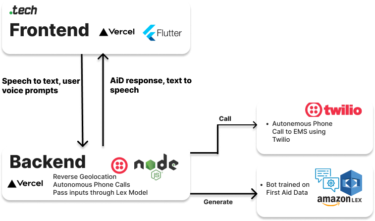

# QuickAid:
## Empowering First Responders
QuickAid is a comprehensive webapp that leverages advanced Speech-to-Text technology to enable users to articulate potential emergencies or inquiries related to first aid. Through this innovative feature, users can obtain prompt and accurate responses, offering tailored first aid advice based on their specific circumstances. In critical situations, where immediate medical attention is warranted, QuickAid seamlessly connects with the appropriate emergency services, expediting ambulance dispatch. The emergency responders are furnished with crucial information, including the nature of the medical emergency (such as heart attack, stroke, etc.) and the precise geolocation of the caller. QuickAid comprises two primary components, namely "Quick" and "Aid," synergistically working together to ensure the utmost efficacy and usefulness of the platform.

## Stack

### Quick: Autonomous Ambulance Dispatch
Quick is designed to trigger phone calls exclusively in emergency situations. When an emergency is detected, Quick utilizes Twilio to initiate a phone call, providing essential incident information to emergency services. During the call, the system dynamically announces the nature of the emergency and shares the geolocation of the caller by retrieving the address of the incident by processing the caller's coordinates in advance. This integrated approach ensures that emergency services are promptly notified with accurate details almost immediatly, enabling them to respond effectively and expedite assistance.

###  Aid: AI-Assisted First Aid
Aid, the Artificial Intelligence Doctor component of QuickAid, utilizes the power of AWS Lex to provide its advanced text classification capabilities. AWS Lex is a natural language understanding service, and Aid leverages this service to process and understand user inquiries to then be able to return the appropriate First Aid intructions. Aid possesses the ability to provide supplementary explanations and assistance in situations where users may have limited comprehension regarding certain procedures, such as CPR.

## Disclaimer
QuickAid is only a proof-of-concept application and is not intended to be used for professional medical advice, treatments or emergencies. Always seek the assistance of a qualified healthcare provider in case of a medical emergency or for specific medical advice.
